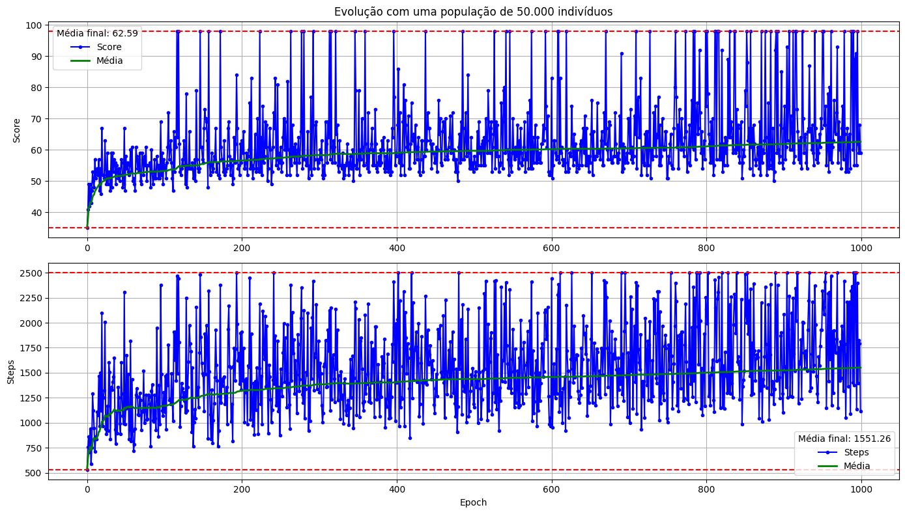

# Snake AI

## Model

## Train

### Simple version

 
<video src="./Docs/best_simple_snake.mp4" width="800" style="display: block; margin: 0 auto" controls></video>

### Complete version

 
<video src="./Docs/best_complete_snake.mp4" width="800" style="display: block; margin: 0 auto" controls></video>

## Best solver

 
<video src="./Docs/zerou.mp4" width="800" style="display: block; margin: 0 auto" controls></video>

## Pathfindings

- https://youtu.be/mZfyt03LDH4
- https://youtu.be/2JNEme00ZFA
- https://youtu.be/MenMqx9pumw

## TODOS

- Portais (por tempo limitado)
- Obstaculos (clicar e adicionar)
- Comida que se mexe (mais devagar?)
- Comidas que valem tamanhos maiores que um
- Representar cobra como gradiente de cor ficando mais claro
- Analisar se eh possível mudar a horientação das setas no meio do jogo

Zerando => https://youtu.be/Vii9XiQ8bec
